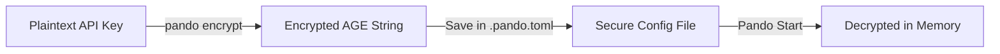

Protecting your credentials is a fundamental part of a safe development workflow. Pando features built-in **AGE Security & Encryption**, allowing you to keep your AI provider credentials and external tool configurations completely secure.

## Why Use Config Security?

When working on software projects, it is very common to store configurations in a local file like `.pando.toml` in your project folder. However, this file often needs to contain sensitive information, such as API keys for Anthropic, OpenAI, or external server configurations. 

If you accidentally commit this file to a public Git repository, your credentials could be exposed.

With **AGE Encryption**, Pando allows you to encrypt any sensitive string (like an API key or database password) directly in your configuration file. 



## How It Works

- **Secure locally**: You encrypt your sensitive parameters using your local user profile key. 
- **Decrypted only in memory**: When Pando starts, it automatically decrypts these values in-memory to communicate with AI providers. The decrypted keys are never written back to disk.
- **Safe for Git**: You can safely commit your `.pando.toml` to Git, because the sensitive parts are encrypted and can only be unlocked using the private key on your authorized development machine.

## Securing Your Settings

### 1. Encrypting a Value

To encrypt a sensitive setting (for instance, a secret token for an external MCP server), use the built-in encryption utility:

```bash
pando encrypt --val "your-secret-key-here"
```

This returns a secure, encrypted text string starting with `age1...`.

### 2. Adding it to Your Configuration

Copy the encrypted string and paste it directly into your `.pando.toml` file under the respective parameter:

```toml
[mcpServers.database-server]
command = "npx"
args = ["-y", "@modelcontextprotocol/server-postgres", "postgresql://localhost/mydb"]
env = { DB_PASSWORD = "age1y7g9w...encrypted-string-here..." }
```

Pando automatically detects that this string is encrypted with AGE and will safely decrypt it when launching the database server, keeping your database credentials shielded from anyone browsing your code repository.

This ensures a robust, enterprise-grade safety standard on your local development machine with minimal configuration effort.
