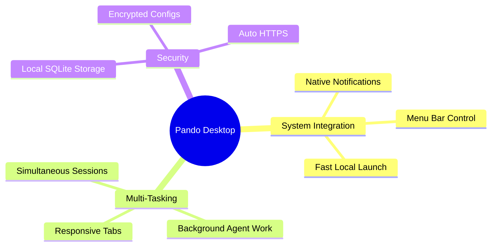

Pando is not only a terminal companion—it is also a fully-fledged, modern **Native Desktop Application** for macOS, Windows, and Linux. Built with performance and elegance in mind, the desktop application combines the full power of Pando's local tools with the convenience of a rich graphical interface.

## Why a Native Desktop App?

While Pando's interactive terminal (TUI) and Web-UI are incredibly powerful, the native desktop application goes a step further by integrating directly with your operating system's features. This creates a highly immersive, distraction-free environment for developer workflows.



## Key Features

- **System Notifications**: Never lose track of long-running tasks. If you delegate a complex job to a sub-agent, you can minimize the application and focus on other work. Pando will automatically send a native desktop notification when the agent completes the task or requires your feedback.
- **Background Session Management**: Run and manage multiple active sessions concurrently. You can have separate tabs for different projects, debug sessions, or research tasks, all working seamlessly in the background without affecting each other.
- **Menu Bar / System Tray Integration**: Access Pando quickly from your operating system's menu bar or system tray. Start new sessions, check agent statuses, or access configuration panels with a single click.
- **Secure by Default**: The desktop application runs over a secure local HTTPS connection using automatically generated local SSL certificates. Your data, conversations, and settings remain entirely stored on your machine in a private SQLite database.
- **Tailored Multi-Platform Experience**:
  - **macOS**: Fully optimized for Apple Silicon (M1/M2/M3) and Intel, utilizing native WebKit renders for buttery-smooth animations and low battery consumption.
  - **Windows**: High-performance, lightweight interface with complete support for secure encryption mechanisms to protect your development settings.

## Getting Started

To launch the desktop application, download the precompiled package for your operating system from the releases page, install it, and open it like any standard application.

If you prefer to compile it from source, ensure you have the developer dependencies installed and build it using the standard build command:

```bash
# Build the embedded desktop bundle
make build-desktop
```

Once opened, you will find a premium, responsive interface featuring hot model switching, an integrated terminal launcher, a tabbed file explorer, and immediate access to your entire local AI workspace.
