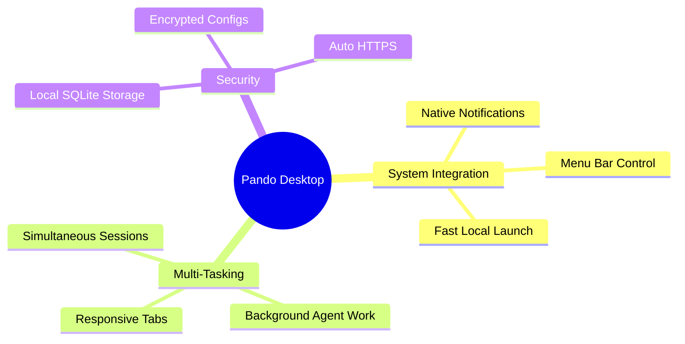

Pando is not only a terminal companion—it is also a fully-fledged, modern **Native Desktop Application** for macOS, Windows, and Linux. Built with performance and elegance in mind, the desktop application combines the full power of Pando's local tools with the convenience of a rich graphical interface.

## Why a Native Desktop App?

While Pando's interactive terminal (TUI) and Web-UI are incredibly powerful, the native desktop application goes a step further by integrating directly with your operating system's features. This creates a highly immersive, distraction-free environment for developer workflows.


```mermaid
mindmap
  root((Pando Desktop))
    System Integration
      Native Notifications
      Menu Bar Control
      Fast Local Launch
    Multi-Tasking
      Simultaneous Sessions
      Background Agent Work
      Responsive Tabs
    Security
      Local SQLite Storage
      Encrypted Configs
      Auto HTTPS
```

## Key Features

- **System Notifications**: Never lose track of long-running tasks. If you delegate a complex job to a sub-agent, you can minimize the application and focus on other work. Pando will automatically send a native desktop notification when the agent completes the task or requires your feedback.
- **Background Session Management**: Run and manage multiple active sessions concurrently. You can have separate tabs for different projects, debug sessions, or research tasks, all working seamlessly in the background without affecting each other.
- **Menu Bar / System Tray Integration**: Access Pando quickly from your operating system's menu bar or system tray. Start new sessions, check agent statuses, or access configuration panels with a single click.
- **Secure by Default**: The desktop application runs over a secure local HTTPS connection using automatically generated local SSL certificates. Your data, conversations, and settings remain entirely stored on your machine in a private SQLite database.
- **Tailored Multi-Platform Experience**:
  - **macOS**: Fully optimized for Apple Silicon (M1/M2/M3) and Intel, utilizing native WebKit renders for buttery-smooth animations and low battery consumption.
  - **Windows**: High-performance, lightweight interface with complete support for secure encryption mechanisms to protect your development settings.

## The window

The desktop app has its own title bar, drawn by Pando instead of the operating system. The minimise, maximise and close buttons sit in the same bar as the session title and the app actions, so the content gets the full height of the window. Drag the bar to move the window.

On Linux and Windows, Pando also adds an icon to the **system tray**. Use it to bring the window back or to quit.

## One window per project

From the **Projects** view you can open a project in its own Pando window with **Open desktop**. Each window works on its own folder, with its own sessions and terminals. If you prefer everything in a single window, open the project as a tab instead: see [Project workspaces]().

## Starting from the app icon

When you open Pando from the Dock, the Start menu or the application launcher, it starts in your home folder as a general workspace. On macOS it also picks up the `PATH` of your login shell, so the tools you installed with Homebrew or a version manager are found the same way as in your terminal.

## Linux: missing libraries

The Linux window needs the GTK 3 and WebKitGTK libraries. If one is missing, Pando says which and shows the command to install it on your distribution, instead of failing with a cryptic error. The [install script]() installs them for you.

If there is no graphical session at all, for example over SSH, Pando explains that there is no display to open a window on. Use `pando serve` and a browser in that case.

## First run

The first time you open the app with nothing configured, the [setup assistant]() walks you through provider, models and memory.

## Getting Started

To launch the desktop application, download the package for your operating system from the [latest release](https://github.com/digiogithub/pando/releases/latest), install it, and open it like any other application. The macOS installer and the Windows binary are signed, so the system opens them without security warnings. See [Cross-Platform Installers]().

If you prefer to compile it from source, ensure you have the developer dependencies installed and build it using the standard build command:

```bash
# Build the embedded desktop bundle
make build-desktop
```

Once opened, you will find a premium, responsive interface featuring hot model switching, an integrated terminal launcher, a tabbed file explorer, and immediate access to your entire local AI workspace.
