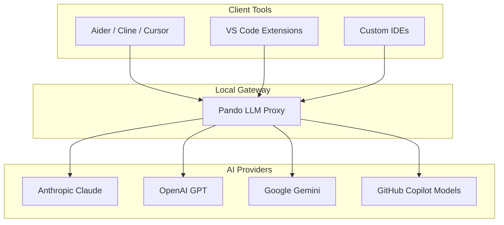

Pando allows you to turn your computer into a centralized, intelligent AI gateway. With the **Local LLM Proxy** feature, you can unburden your development workflow and seamlessly share your configured AI models with other developer tools in your ecosystem.

## What is the Local LLM Proxy?

Instead of configuring API keys, settings, and model endpoints in every single developer tool you use (such as external code editors, CLI tools, or browser assistants), Pando can act as a single, local bridge. 

By starting a local proxy server, Pando unifies all your configured AI providers (Anthropic, OpenAI, Google Gemini, and even your GitHub Copilot subscription models) and exposes them through a single local endpoint. This endpoint is fully compatible with standard AI client formats (OpenAI-compatible APIs).



## Key Benefits

- **Single Point of Configuration**: Enter your API keys and model preferences once in Pando, and let all other tools leverage them instantly.
- **GitHub Copilot Integration**: Access the powerful models bundled with your GitHub Copilot subscription outside of your main IDE, making it easy to use Copilot models in external command-line tools or secondary editors.
- **Improved Performance**: Leverage Pando's smart token management and local routing to avoid redundant network setups and keep all communication lightning-fast.
- **Security & Privacy**: Your API keys remain securely stored in your local Pando profile. Other tools connect only to your local machine, keeping your credentials safe.

## Using the Proxy

### Starting the Server

Starting your local AI gateway is simple. Just run:

```bash
pando llm-proxy
```

By default, this launches a local secure server on your computer that listens for incoming requests from other applications.

### Connecting External Tools

To connect an external tool (like Aider, Cline, or an editor plugin), simply configure it to point to your local Pando proxy.

- **API Base URL**: `http://localhost:8765/v1` (or the secure URL shown when launching the proxy)
- **API Key**: Any placeholder text (Pando will securely authenticate using the keys defined in your `.pando.toml` or system profile).

This enables you to use your favorite AI assistants with Pando's unified model list, ensuring a seamless, consistent, and cost-effective coding experience across your entire environment.
