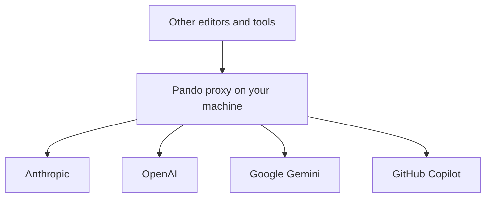

You already told Pando which AI accounts you have. The local proxy lets your other tools borrow them, so you do not have to paste the same keys into every program. It works like the Wi-Fi router at home: one contract with the provider, and every device in the house connects through it.

## What it does for you

- **Set up once.** Your keys and model choices live in Pando. Another editor, a command-line assistant or a browser add-on connects to Pando and uses them.
- **Take your Copilot models elsewhere.** The models that come with your GitHub Copilot subscription become usable in tools that know nothing about Copilot.
- **Keep your keys at home.** The other tools only talk to your own machine. Your real keys never leave Pando.
- **One list of models everywhere.** Every tool sees the same names, so you stop wondering which model is behind which setting.

## How it feels in practice

You start the proxy and leave it running, like switching the router on. In the other tool you type a local address where it asks for "the API address", and any text where it asks for a key. From then on that tool lists Pando's models and uses them as if they were its own.

```mermaid
flowchart TD
    A[Other editors and tools] --> P[Pando proxy on your machine]
    P --> B[Anthropic]
    P --> C[OpenAI]
    P --> D[Google Gemini]
    P --> E[GitHub Copilot]
```

## When to use it

Use it when you work with more than one AI tool and are tired of configuring each one, or when a tool you like has no way to sign in to a provider you already pay for.

You do not need it if Pando is the only assistant you use.

## Good to know

- The proxy speaks the format most tools expect ("OpenAI-compatible").
- It listens only on your own machine unless you tell it otherwise. If you open it to your network, start it with a key of its own so not everyone nearby can use your accounts.
- It runs while its terminal is open. Close it and the other tools lose their connection.

## Next steps

- Guide: [Use Pando from your editor and other apps]() shows how to start it and connect a tool.
- Reference: [command options]().
- Related: [GitHub Copilot Auth]().
