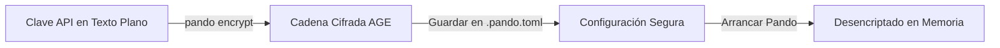

Proteger tus credenciales es una parte fundamental de un flujo de trabajo de desarrollo seguro. Pando incluye un sistema integrado de **Seguridad y Cifrado AGE**, que te permite mantener las credenciales de tus proveedores de IA y la configuración de tus herramientas externas completamente protegidas.

## ¿Por qué proteger tu configuración?

Al trabajar en proyectos de software, es muy común almacenar las preferencias en un archivo local como `.pando.toml` en la carpeta de tu proyecto. Sin embargo, este archivo a menudo contiene información sensible, como claves de API para Anthropic, OpenAI o endpoints privados de servidores.

Si confirmas y subes accidentalmente este archivo a un repositorio público de Git, tus credenciales podrían quedar expuestas.

Con el **Cifrado AGE**, Pando te permite encriptar cualquier cadena de texto sensible (como una clave de API o la contraseña de una base de datos) directamente en tu archivo de configuración.



## ¿Cómo funciona?

- **Cifrado local sencillo**: Encriptas tus datos sensibles utilizando la clave de seguridad de tu perfil de usuario.
- **Desencriptado solo en memoria**: Cuando arrancas Pando, el sistema descifra automáticamente estos valores en memoria para comunicarse con los proveedores de IA. Las claves descifradas nunca se escriben de vuelta en el disco.
- **Seguro para compartir**: Puedes subir tu archivo `.pando.toml` a Git sin preocupaciones, ya que las partes sensibles están cifradas y solo se pueden desbloquear con la clave privada de tu máquina de desarrollo autorizada.

## Protegiendo tus Preferencias

### 1. Cifrar un Valor

Para encriptar una preferencia sensible (por ejemplo, un token secreto para un servidor MCP externo), utiliza la utilidad de cifrado integrada de Pando:

```bash
pando encrypt --val "tu-clave-secreta-aqui"
```

Esto generará una cadena de texto cifrada y segura que comienza con `age1...`.

### 2. Añadirlo a la Configuración

Copia la cadena de texto cifrada y pégala directamente en tu archivo `.pando.toml` en el parámetro correspondiente:

```toml
[mcpServers.database-server]
command = "npx"
args = ["-y", "@modelcontextprotocol/server-postgres", "postgresql://localhost/mydb"]
env = { DB_PASSWORD = "age1y7g9w...cadena-cifrada-aqui..." }
```

Pando detectará automáticamente que la cadena está encriptada con AGE y la descifrará de forma segura en memoria al arrancar el servidor de la base de datos, manteniendo tus contraseñas protegidas frente a cualquier persona que explore el repositorio del código.

Esto garantiza un estándar de seguridad profesional en tu máquina de desarrollo con el mínimo esfuerzo de configuración.
