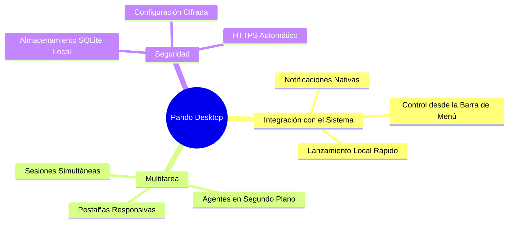

Pando no es solo un asistente de terminal: también es una **Aplicación de Escritorio Nativa** moderna y completa para macOS, Windows y Linux. Diseñada con un enfoque en el rendimiento y la elegancia, la aplicación de escritorio combina toda la potencia de las herramientas locales de Pando con la comodidad de una interfaz gráfica avanzada.

## ¿Por qué una Aplicación de Escritorio Nativa?

Aunque la terminal interactiva (TUI) y la Web-UI de Pando son increíblemente potentes, la aplicación de escritorio va un paso más allá al integrarse directamente con las características de tu sistema operativo. Esto crea un entorno de trabajo inmersivo y sin distracciones para tus flujos de desarrollo.



## Características Clave

- **Notificaciones del Sistema**: No pierdas nunca el hilo de las tareas largas. Si delegas un trabajo complejo a un subagente, puedes minimizar la aplicación y concentrarte en otra tarea. Pando enviará automáticamente una notificación nativa al escritorio cuando el agente termine su labor o requiera tu confirmación.
- **Gestión de Sesiones en Segundo Plano**: Ejecuta y gestiona múltiples sesiones activas simultáneamente. Puedes tener pestañas independientes para distintos proyectos, sesiones de depuración de código o tareas de investigación, trabajando todas en segundo plano sin interferencias.
- **Acceso Directo en la Barra de Menú**: Abre Pando rápidamente desde la barra de menú o la bandeja del sistema de tu sistema operativo. Inicia nuevas sesiones, comprueba el estado de tus agentes o accede al panel de configuración con un solo clic.
- **Seguridad Garantizada**: La aplicación de escritorio funciona a través de una conexión local segura HTTPS mediante certificados SSL autogenerados de forma automática durante el arranque. Tus datos, conversaciones y preferencias se guardan de manera privada en tu ordenador en una base de datos SQLite.
- **Experiencia de Escritorio Premium**:
  - **macOS**: Totalmente optimizada para Apple Silicon (M1/M2/M3) e Intel, utilizando renderizado WebKit nativo para ofrecer transiciones fluidas y un consumo de batería mínimo.
  - **Windows**: Interfaz ligera y de alto rendimiento con soporte completo para cifrado seguro para mantener tus credenciales protegidas.

## Cómo Empezar

Para iniciar la aplicación de escritorio, descarga el paquete precompilado correspondiente a tu sistema operativo desde la sección de lanzamientos, instálalo y ábrelo como cualquier otra aplicación.

Si prefieres compilarla desde las fuentes del proyecto, asegúrate de tener instaladas las dependencias de desarrollo y compila el paquete usando el comando:

```bash
# Compilar el paquete de escritorio embebido
make build-desktop
```

Una vez abierta, descubrirás una interfaz fluida e intuitiva con cambio de modelos en caliente, un lanzador de terminal integrado, un explorador de archivos con pestañas y acceso inmediato a todo tu espacio de trabajo local con Inteligencia Artificial.
