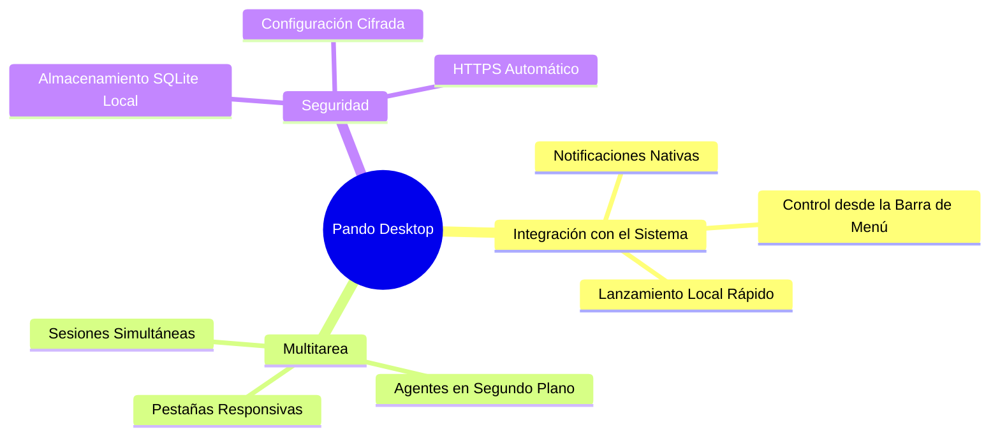

Pando no es solo un asistente de terminal: también es una **Aplicación de Escritorio Nativa** moderna y completa para macOS, Windows y Linux. Diseñada con un enfoque en el rendimiento y la elegancia, la aplicación de escritorio combina toda la potencia de las herramientas locales de Pando con la comodidad de una interfaz gráfica avanzada.

## ¿Por qué una Aplicación de Escritorio Nativa?

Aunque la terminal interactiva (TUI) y la Web-UI de Pando son increíblemente potentes, la aplicación de escritorio va un paso más allá al integrarse directamente con las características de tu sistema operativo. Esto crea un entorno de trabajo inmersivo y sin distracciones para tus flujos de desarrollo.


```mermaid
mindmap
  root((Pando Desktop))
    Integración con el Sistema
      Notificaciones Nativas
      Control desde la Barra de Menú
      Lanzamiento Local Rápido
    Multitarea
      Sesiones Simultáneas
      Agentes en Segundo Plano
      Pestañas Responsivas
    Seguridad
      Almacenamiento SQLite Local
      Configuración Cifrada
      HTTPS Automático
```

## Características Clave

- **Notificaciones del Sistema**: No pierdas nunca el hilo de las tareas largas. Si delegas un trabajo complejo a un subagente, puedes minimizar la aplicación y concentrarte en otra tarea. Pando enviará automáticamente una notificación nativa al escritorio cuando el agente termine su labor o requiera tu confirmación.
- **Gestión de Sesiones en Segundo Plano**: Ejecuta y gestiona múltiples sesiones activas simultáneamente. Puedes tener pestañas independientes para distintos proyectos, sesiones de depuración de código o tareas de investigación, trabajando todas en segundo plano sin interferencias.
- **Acceso Directo en la Barra de Menú**: Abre Pando rápidamente desde la barra de menú o la bandeja del sistema de tu sistema operativo. Inicia nuevas sesiones, comprueba el estado de tus agentes o accede al panel de configuración con un solo clic.
- **Seguridad Garantizada**: La aplicación de escritorio funciona a través de una conexión local segura HTTPS mediante certificados SSL autogenerados de forma automática durante el arranque. Tus datos, conversaciones y preferencias se guardan de manera privada en tu ordenador en una base de datos SQLite.
- **Experiencia de Escritorio Premium**:
  - **macOS**: Totalmente optimizada para Apple Silicon (M1/M2/M3) e Intel, utilizando renderizado WebKit nativo para ofrecer transiciones fluidas y un consumo de batería mínimo.
  - **Windows**: Interfaz ligera y de alto rendimiento con soporte completo para cifrado seguro para mantener tus credenciales protegidas.

## La ventana

La app de escritorio tiene su propia barra de título, dibujada por Pando y no por el sistema operativo. Los botones de minimizar, maximizar y cerrar están en la misma barra que el título de la sesión y las acciones de la app, así que el contenido ocupa toda la altura de la ventana. Arrastra la barra para mover la ventana.

En Linux y Windows, Pando añade además un icono en la **bandeja del sistema**. Úsalo para recuperar la ventana o para salir.

## Una ventana por proyecto

Desde la vista **Projects** puedes abrir un proyecto en su propia ventana de Pando con **Open desktop**. Cada ventana trabaja sobre su carpeta, con sus sesiones y sus terminales. Si prefieres tenerlo todo en una sola ventana, abre el proyecto como pestaña: consulta [Espacios de trabajo de proyecto]().

## Arrancar desde el icono de la app

Cuando abres Pando desde el Dock, el menú Inicio o el lanzador de aplicaciones, arranca en tu carpeta personal como espacio de trabajo general. En macOS recoge además el `PATH` de tu shell de inicio de sesión, así que encuentra las herramientas que instalaste con Homebrew o con un gestor de versiones igual que tu terminal.

## Linux: bibliotecas que faltan

La ventana en Linux necesita las bibliotecas GTK 3 y WebKitGTK. Si falta alguna, Pando dice cuál y muestra el comando para instalarla en tu distribución, en lugar de fallar con un error críptico. El [script de instalación]() las instala por ti.

Si no hay ninguna sesión gráfica, por ejemplo por SSH, Pando explica que no hay pantalla donde abrir una ventana. En ese caso usa `pando serve` y un navegador.

## Primer arranque

La primera vez que abres la app sin nada configurado, el [asistente de configuración]() te guía por proveedor, modelos y memoria.

## Cómo Empezar

Para iniciar la aplicación de escritorio, descarga el paquete de tu sistema operativo desde la [última versión](https://github.com/digiogithub/pando/releases/latest), instálalo y ábrelo como cualquier otra aplicación. El instalador de macOS y el binario de Windows están firmados, así que el sistema los abre sin avisos de seguridad. Consulta [Instaladores Multi-Plataforma]().

Si prefieres compilarla desde las fuentes del proyecto, asegúrate de tener instaladas las dependencias de desarrollo y compila el paquete usando el comando:

```bash
# Compilar el paquete de escritorio embebido
make build-desktop
```

Una vez abierta, descubrirás una interfaz fluida e intuitiva con cambio de modelos en caliente, un lanzador de terminal integrado, un explorador de archivos con pestañas y acceso inmediato a todo tu espacio de trabajo local con Inteligencia Artificial.
