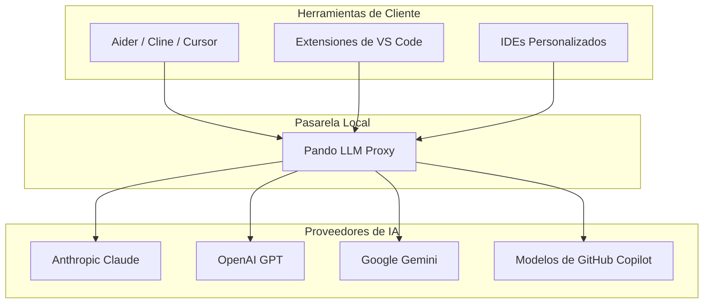

Pando te permite transformar tu ordenador en una pasarela inteligente y centralizada de Inteligencia Artificial. Con la función de **Proxy de Modelos Local**, puedes simplificar tu flujo de trabajo de desarrollo y compartir de forma transparente tus modelos de IA configurados con otras herramientas de desarrollo de tu ecosistema.

## ¿Qué es el Proxy de Modelos Local?

En lugar de tener que configurar claves de API, parámetros y endpoints de modelos en cada una de las herramientas de desarrollo que utilizas (como editores de código externos, utilidades de terminal o asistentes del navegador), Pando puede actuar como un único puente local.

Al iniciar el servidor proxy local, Pando unifica todos tus proveedores de IA configurados (Anthropic, OpenAI, Google Gemini y también los modelos de tu suscripción de **GitHub Copilot**) y los expone a través de un único endpoint local. Este endpoint es totalmente compatible con los formatos estándar de los clientes de IA (APIs compatibles con OpenAI).



## Beneficios Clave

- **Configuración en un Único Punto**: Introduce tus claves de API y preferencias de modelo una sola vez en Pando, y deja que todas las demás herramientas las aprovechen al instante.
- **Integración con GitHub Copilot**: Accede a los potentes modelos incluidos en tu suscripción de GitHub Copilot fuera de tu entorno de desarrollo habitual, facilitando su uso en herramientas de terminal o editores secundarios.
- **Rendimiento Mejorado**: Aprovecha la gestión inteligente de tokens y el enrutamiento local de Pando para evitar conexiones redundantes en la red y mantener toda la comunicación a la máxima velocidad.
- **Seguridad y Privacidad**: Tus claves de API permanecen almacenadas de forma segura en tu perfil local de Pando. Las herramientas externas solo se conectan a tu máquina local, manteniendo a salvo tus credenciales.

## Uso del Proxy

### Iniciar el Servidor

Arrancar tu pasarela local de IA es muy sencillo. Solo tienes que ejecutar:

```bash
pando llm-proxy
```

Por defecto, esto iniciará un servidor seguro en tu ordenador que escuchará las peticiones entrantes de otras aplicaciones.

### Conectar Herramientas Externas

Para conectar una herramienta externa (como Aider, Cline o un plugin de tu editor), simplemente configúrala para que apunte a tu proxy local de Pando.

- **URL Base de la API**: `http://localhost:8765/v1` (o la dirección segura que se muestre al iniciar el proxy)
- **Clave de API**: Cualquier texto de prueba (Pando autenticará de forma segura utilizando las claves definidas en tu `.pando.toml` o perfil del sistema).

Esto te permite utilizar tus asistentes de IA favoritos con la lista unificada de modelos de Pando, asegurando una experiencia de desarrollo coherente, fluida y económica en todo tu entorno de trabajo.
