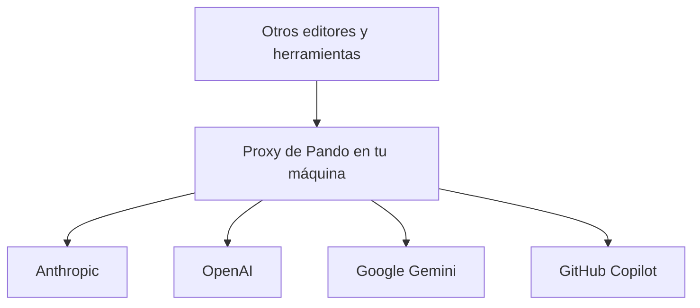

Ya le dijiste a Pando qué cuentas de IA tienes. El proxy local deja que tus otras herramientas las tomen prestadas, para que no tengas que pegar las mismas claves en cada programa. Funciona como el router de casa: un solo contrato con la compañía, y todos los aparatos se conectan a través de él.

## Qué hace por ti

- **Configuras una vez.** Tus claves y tus modelos viven en Pando. Otro editor, un asistente de línea de comandos o una extensión del navegador se conectan a Pando y los usan.
- **Te llevas los modelos de Copilot a otros sitios.** Los modelos de tu suscripción de GitHub Copilot se pueden usar en herramientas que no saben nada de Copilot.
- **Las claves se quedan en casa.** Las otras herramientas solo hablan con tu propia máquina. Tus claves de verdad no salen de Pando.
- **Una misma lista de modelos en todas partes.** Todas las herramientas ven los mismos nombres, y dejas de preguntarte qué modelo hay detrás de cada ajuste.

## Cómo se nota en el día a día

Arrancas el proxy y lo dejas abierto, como quien enciende el router. En la otra herramienta escribes una dirección local donde te pide «la dirección de la API», y cualquier texto donde te pide una clave. Desde entonces esa herramienta lista los modelos de Pando y los usa como si fueran suyos.

```mermaid
flowchart TD
    A[Otros editores y herramientas] --> P[Proxy de Pando en tu máquina]
    P --> B[Anthropic]
    P --> C[OpenAI]
    P --> D[Google Gemini]
    P --> E[GitHub Copilot]
```

## Cuándo usarlo

Úsalo cuando trabajas con más de una herramienta de IA y te has cansado de configurar cada una, o cuando una herramienta que te gusta no tiene forma de iniciar sesión en un proveedor que ya pagas.

No lo necesitas si Pando es el único asistente que usas.

## Conviene saber

- El proxy habla el formato que espera la mayoría de herramientas («compatible con OpenAI»).
- Solo escucha en tu propia máquina, salvo que le digas otra cosa. Si lo abres a tu red, arráncalo con una clave propia para que no pueda usar tus cuentas cualquiera que esté cerca.
- Funciona mientras su terminal está abierta. Si la cierras, las otras herramientas pierden la conexión.

## Siguientes pasos

- Guía: [Usa Pando desde tu editor y otras aplicaciones]() enseña a arrancarlo y a conectar una herramienta.
- Referencia: [opciones del comando]().
- Relacionado: [Autenticación con GitHub Copilot]().
